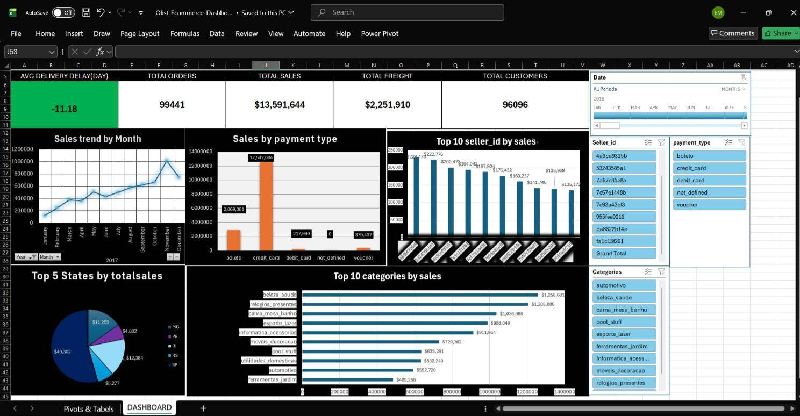

[README.md](https://github.com/user-attachments/files/32129118/README.md)
# 📊 Olist E-Commerce Sales & Delivery Dashboard

An interactive Excel dashboard analyzing the **Olist Brazilian E-Commerce** public dataset. It transforms raw, multi-table transactional data into actionable business insights on sales trends, seller performance, product categories, payment methods, and geographic distribution — built with Pivot Tables, Pivot Charts, Slicers, and a Timeline.

📥 **[Download the Excel file (.xlsx)](https://docs.google.com/spreadsheets/d/1Wt1-7br4mpT40xC9-J07I61TTvcLAJi4/export?format=xlsx)**

---

## 📌 Project Overview

This project features an interactive dashboard built in **Microsoft Excel** using the **Olist Brazilian E-Commerce Public Dataset**. The goal was to transform raw, multi-table transactional data into actionable business insights regarding sales performance, delivery analysis, and top seller/category performance.

## 🧰 Tools & Techniques

- Microsoft Excel
- Power Query (data cleaning & transformation)
- Power Pivot / Data Model (relationships across multiple tables)
- Pivot Tables & Pivot Charts
- Slicers & Timeline (interactive filtering)

## 📈 Key Features

- **KPI Cards** — total sales, order count, average order value, growth rate
- **Sales Trend by Month** — line chart tracking monthly sales across 2017–2018
- **Sales by Payment Type** — comparison of boleto, credit card, debit card, and voucher
- **Top 10 Sellers by Sales**
- **Top 10 Categories by Sales**
- **Top 5 States by Total Sales** — geographic breakdown
- Fully interactive filtering via Slicers and a monthly Timeline

## 📂 Data Source

[Olist Brazilian E-Commerce Public Dataset](https://www.kaggle.com/datasets/olistbr/brazilian-ecommerce) — ~100k orders from 2016–2018 across multiple Brazilian marketplaces.

## ⚠️ Note

Due to a limitation with how Excel Slicers interact with Top-N filtered charts, the "Top 5 States" and "Top 10 Categories" charts are intentionally kept independent of the monthly Timeline filter and always reflect the full time period.

